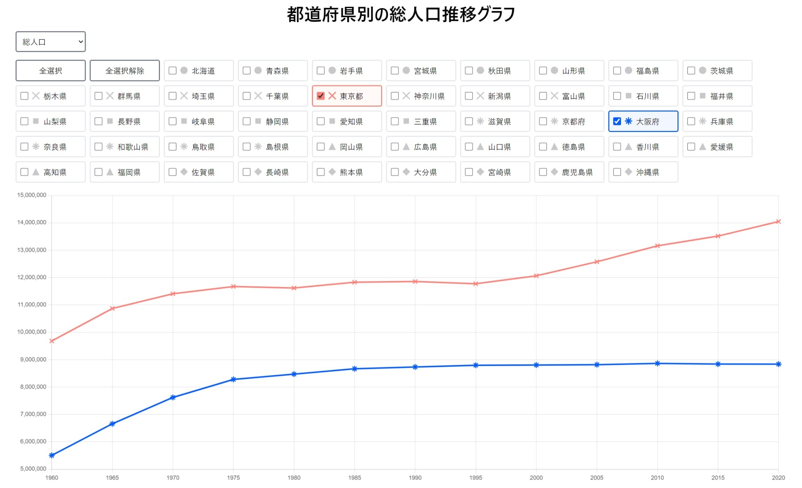

# Yumemi Population Graph

都道府県別の総人口推移グラフを表示するSPA（ゆめみコーディング試験）

## 概要

RESAS(地域経済分析システム) から都道府県別の総人口推移データを取得し、グラフ表示するSPAです。
データは [RESAS API](https://opendata.resas-portal.go.jp/) を使用して取得しています。
また、サーバーへのリクエスト回数を減らすため、取得したデータはローカルストレージにキャッシュしています。

[アプリURLはこちら](https://yumemi-population-graph.netlify.app/)

## プレビュー

デスクトップ版

|         トップ画面          |
| :-------------------------: |
|       |
| 選択した都道府県だけを表示  |
|  |
|     老年人口へ切り替え      |
|   |

モバイル版

|          選択           |         グラフ          |
| :---------------------: | :---------------------: |
|  |  |

## ローカル環境での実行方法

1. リポジトリをクローン

```bash
git clone https://github.com/kage1020/YumemiPopulationGraph.git
```

2. RESAS API の API Key を取得
3. プロジェクトルートに `.env` ファイルを作成し、取得した API Key を記述

```
VITE_RESAS_API_KEY=取得したAPIキー
```

4. 依存パッケージのインストール

```bash
pnpm install
```

5. Reactの起動

```bash
pnpm dev
```

## 使用技術

- [React](https://react.dev/): フロントエンドフレームワーク
- [Vite](https://vitejs.dev/): ビルドツール
- [Tailwind CSS](https://tailwindcss.com/): CSSフレームワーク
- [Chart.js](https://www.chartjs.org/): グラフ描画ライブラリ
- [Vitest](https://vitest.dev/): テストフレームワーク
- [React Testing Library](https://testing-library.com/): テストユーティリティ

## 謝辞

このアプリケーションは、RESAS API を使用しています。RESAS API の提供に感謝いたします。
